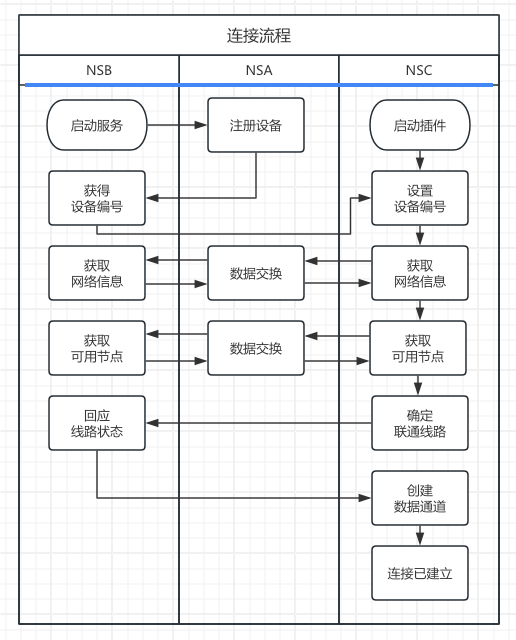

# Obsidian NAS 同步服务

## 项目结构

* Cloud Server: 简称`NSA`, 整个服务体系的中控服务器, 负责`NSB`与`NSC`连接尚未建立时的数据交换、通道管理、鉴权
* NAS Server: 简称 `NSB`, 数据存储服务器, 负责存储`Obsidian`中的数据并与其他客户端进行同步
* Obsidian Plugin: 简称 `NSC`, 最终客户端, 与`NSB`同步数据

## 网络拓扑

